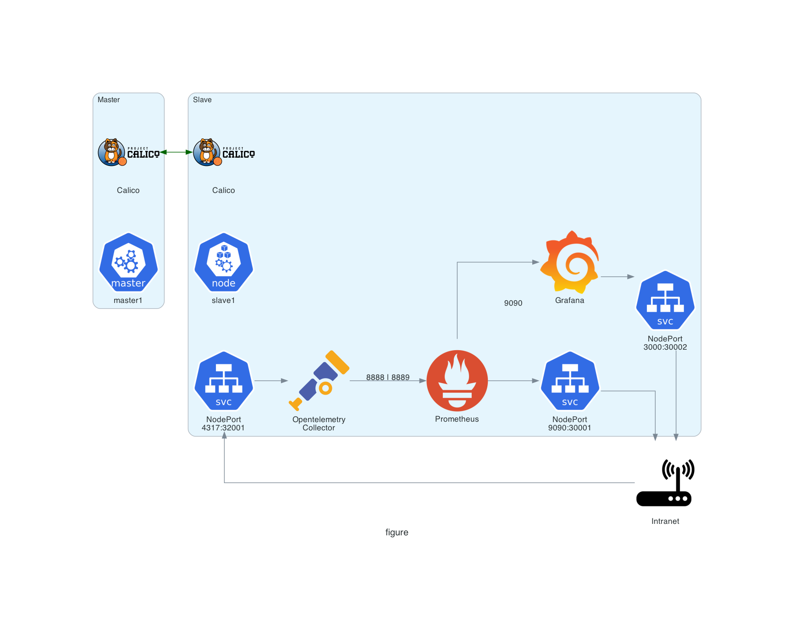

# Configuring On-Premise Kubernetes Cluster with OpenTelemetry, Prometheus, Grafana Stack, and Calico Container Network Interface

This document outlines the process and steps involved in configuring on-premise
k8s cluster with stack comprising:
- OpenTelemetry for observability
- Prometheus for monitoring
- Grafana for visualization
- Calico for networking

## Objectives:
1. Implement Opentelemetry, Prometheus and Grafana in the slave pod.
2. Ensuring that the Opentelemetry Collector is able to receive telemetry data
   via NodePort 32001.
3. Ensuring that the Prometheus container able to scrap metrics via Cluster IP
   Port 8888 and 8889.
4. Ensuring that the Grafana container able to visualise metrics collected by
   the Prometheus container.

## Sprint Plan:

### Duration
Start Date: 02-05-23 
End Date: 07-05-23

### Goals:
- Configure OpenTelemetry Collector for collecting telemetry data via NodePort 
  30001.
- Configure Prometheus to scrape metrics from:
    - Opentelemetry Collector Cluster IP 8889
    - Opentelemetry Collector Cluster IP 8888
- Configure Grafana for collecting Prometheus metrics via Cluster IP 9090.

### Backlog:
- Configure and deploy OTel-Prometheus-Grafana stack in the cluster.
